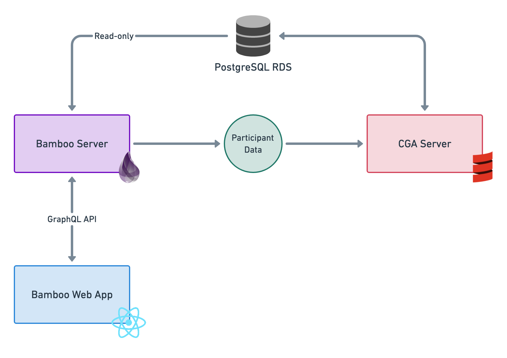

# Bamboo I Viability Assessment

- [Overview](#overview)
- [Problems areas](#problem-areas)
  - [Data access](#data-access)
  - [Design components](#design-components)
  - [Out-of-band decisions](#out-of-band-decisions)
  - [Participant accounts](#participant-accounts)
- [Tasks for CGA](#tasks-for-cga)
- [Architecture diagram](#architecture-diagram)
- [Prototype](#prototype)

## Overview

NewAperio has completed a viability assessment for the Bamboo I project (hereafter referred to as _Bamboo_) to ensure that the necessary technology requirements can be met. After a deep dive into the existing [Common Ground for Action (CGA)][cga] application and data model, and collaboration with the [Every Voice Engaged (EVE)][eve] technology team, we’ve uncovered a well-defined problem space and have come up with solutions that will allow the project to move forward.

## Problem Areas

These are the problem areas that we identified, and are described in further detail later in the document:

1. Data access
2. Design components
3. Out-of-band decisions
4. Participant accounts

### Data Access

#### Problem

Data essential to the Bamboo experience is tied into the CGA environment and not exposed via a web API or other externally-accessible mechanism. This data includes things like:

- Issue guides
- Options
- Actions
- Drawbacks

#### Solution

NewAperio will build a proxy server application that will connect directly to CGA’s database instance via a read-only connection and expose the required data over a well-defined GraphQL web API. This application will be delivered to the CGA team as a container that can be deployed into their Kubernetes cluster, minimizing the devops work around deployment.

We discussed other options with the CGA team that would involve them making non-neglible changes to the exising legacy codebase:

- Experimenting with [Lift’s REST helpers][lift-rest]
- Building a bespoke [JSON:API] service

After evaluating the tradeoffs, both teams decided that the solution we chose would be best — it ensures we have access to the data Bamboo needs and requires no modification of the legacy app.

### Design Components

#### Problem

Some of the content included in the [prototype designs] are not available in the CGA application. This includes:

- Issue guide cover images
- Issue guide categories

#### Solution

After consulting with our senior designer, we feel like we can build Bamboo without this content, but it will have some impact on user experience. Without issue guide thumbnail images, the main screen of the app will be text-heavy. Without categories, quickly skimming to understand what topic an issue guide covers may be more challenging.

This content, though not essential, would be nice to have and we’ve identified a couple of potential pathways for getting access to it:

- The CGA team could add fields to the legacy app to allow issue guide authors to specify an image and category
- The [EVE website][eve], a WordPress app, has the content we need and there are plugins for WordPress that can provide a drop-in web API. The difficult part of this approach, however, is linking up the WordPress data with the correct CGA issue guides.

Both of these options require work from the CGA team but not much work on our part, so we will defer to CGA on this decision.

### Out-of-band Decisions

#### Problem

In the current CGA app, participant decisions, e.g. chosen options, actions, evaluations, are recorded as part of an event stream during the forum experience. Bamboo records these decisions outside of the forum experience and CGA has not yet decided how they will be reconciled with the the event stream paradigm.

### Solution

NewAperio will store user decisions as part of the Bamboo application. When a complete set of decisions has been recorded, Bamboo will make the information available to CGA via a webhook event, Amazon SQS queue, or some similar mechanism.

This architecture decouples Bamboo’s data recording implementation from the CGA app, leaving the CGA team to design their solution without restrictions.

### Participant accounts

#### Problem

Persistent user accounts are not part of the existing CGA application; that is to say, a new user is generated per participant, per forum and does not exist outside of that context. CGA is working on implementing peristent accounts but there is no planned solution for ingesting external account data.

#### Solution

Bamboo will implement its own user authentication system, which will allow users to sign up for multiple forums without having to log in each time. When webhook events are sent to CGA, indentifying user information will be included. Like the decisions themselves, this somewhat decouples the two apps and allows CGA to build a solution without inteference or restriction.

## Architecture Diagram

Below is a diagram describing key parts of the Bamboo architecture:

- Server app
- Web front end
- Read-only database connection
- GraphQL API
- Webhook events

## Prototype

As part of our viability assessment we created a [prototype Elixir/Phoenix application][prototype-app] that connects to a local CGA database and exposes a GraphQL API. The prototype works well and gives us confidence in the technical decisions we made throughout our assessment.

[cga]: https://findcommonground.org/
[eve]: https://www.everyvoiceengaged.org/
[lift-rest]: https://simply.liftweb.net/index-Chapter-5.html#toc-Chapter-5
[json:api]: https://jsonapi.org/
[prototype designs]: https://projects.invisionapp.com/d/main#/projects/prototypes/21166485
[prototype-app]: prototype
